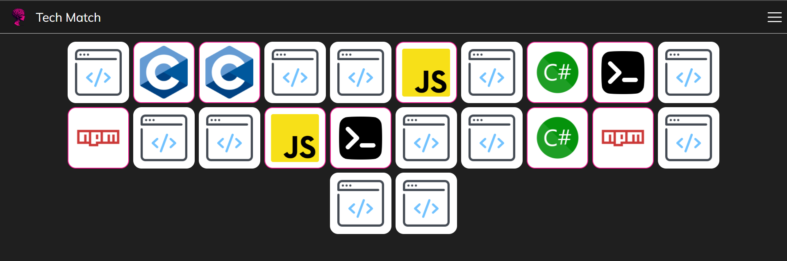
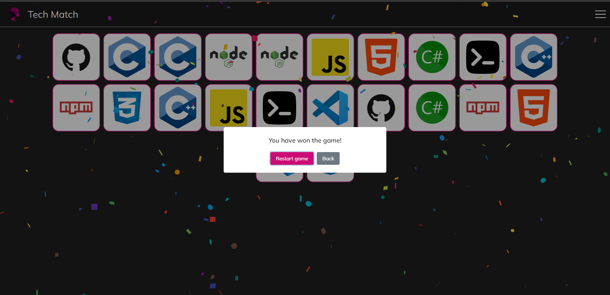

# Tech Match

Welcome to the Tech Match Memory Game! This web-based game challenges your memory skills while showcasing popular programming language icons. Flip the cards and try to find all the matching pairs to win the game.

## Demo

You can play the game online at [This link](https://tech-match.vercel.app/)

## Installation

To run the Programming Language Memory Game locally, follow these steps:

1. Clone the repository:

```bash
git clone https://github.com/YourUsername/Programming-Language-Memory-Game.git
```
2. Navigate to the project directory:

```bash
cd Tech-Match
```
3. Install the dependencies:

```bash
npm install
```
4. Start the development server:

```bash
npm run dev
```

5. Open your browser and visit http://localhost:5173 to play the game.

## How to Play

1. Upon starting the game, you will have to choose the amount of cards you want to play with.

[](https://tech-match.vercel.app/)

2. After choosing the amount of cards you want, you will see a grid of facedown cards, each containing an icon of a programming language.

[](https://tech-match.vercel.app/)

3. Click on a second card to reveal its icon. If the icons match, the cards remain face up. If they don't match, they will be flipped face down again.

4. Continue flipping cards and finding matching pairs until all cards are revealed.

5. The game ends when all pairs are successfully matched. You can then choose to play again.

[](https://tech-match.vercel.app/)

## Customization

You can customize the game by adding or modifying the programming language icons. The icons are stored in the /public/img directory. Simply replace the existing images with your desired icons, ensuring they have the same filenames and formats.

If you want to add new images to the game without removing the existing ones you'll have to edit the ``` App.jsx``` script file and add the path of the image that you added to the folder TWICE in the array of avaiableCards.

For example: if you added an image called ``` foo.png ``` you will have to add in the array the following lines:

``` 
./img/foo.png,
./img/foo.png,
```